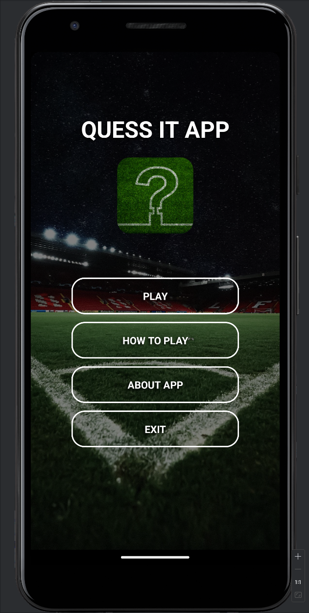
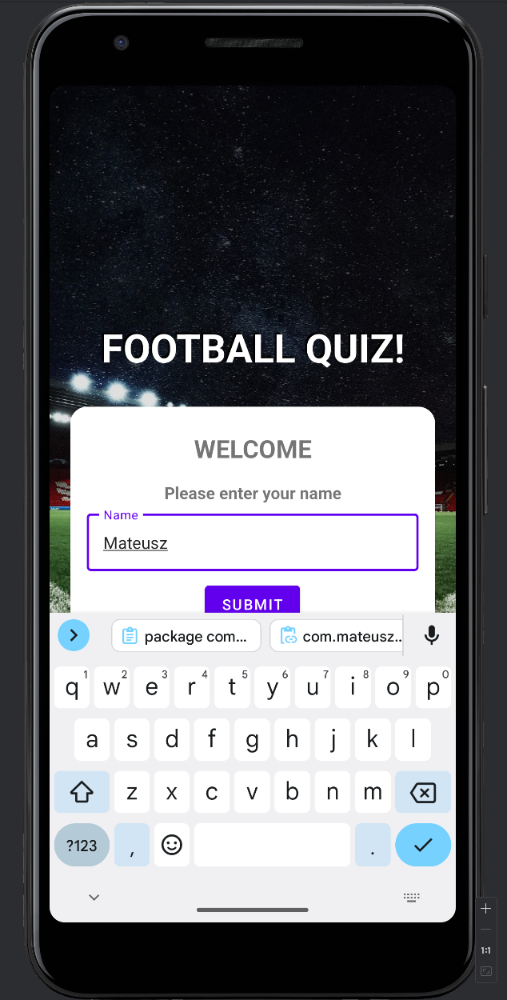
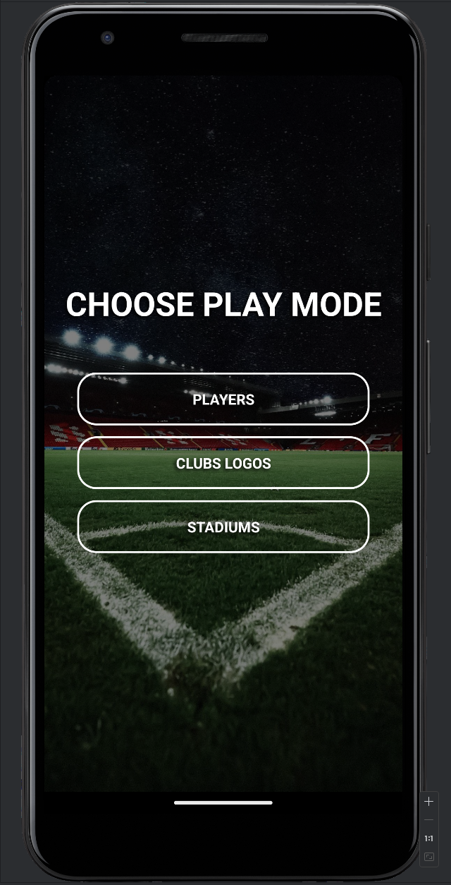
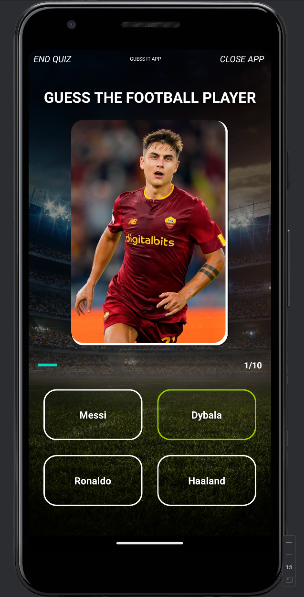
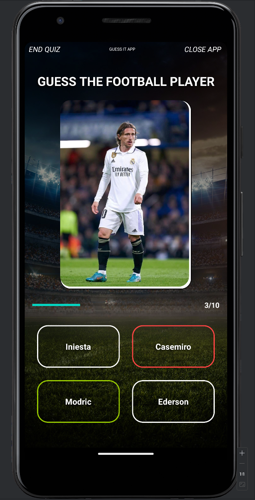
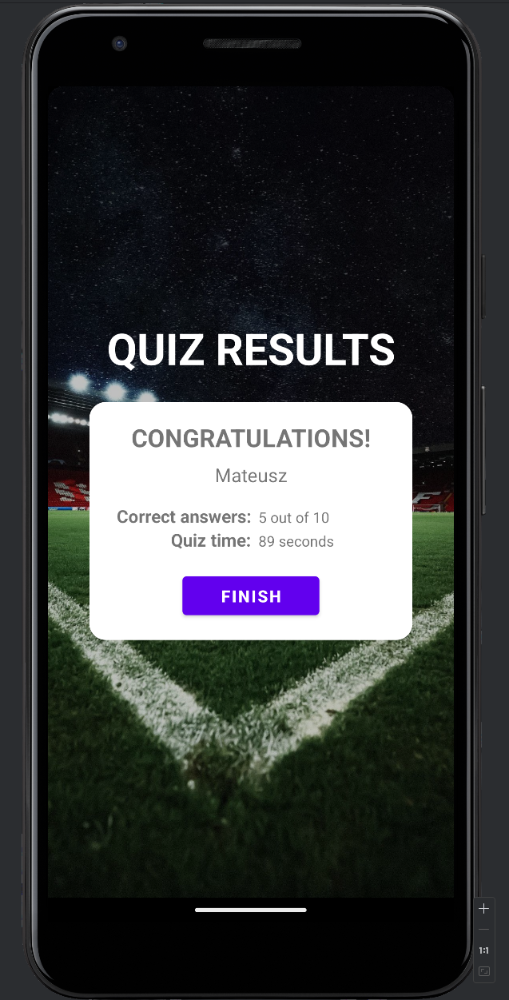

# Guess-It-App

Welcome to Guess-It-App! This is a quiz application where you can test your knowledge about football players, clubs, and stadiums.

## Overview

GuessItApp allows users to choose from three different modes:

- **Players Mode:** Guess the football player based on the image provided.
- **Clubs Logos Mode:** Guess the football club name based on its logo.
- **Stadiums Mode:** Guess the name of the football stadium based on its image.

## Additional Activities

### HowToPlayActivity

This activity provides instructions on how to play the game.

- **Description:** Presents a brief overview of the game.
- **Usage:** Clicking the "OK" button redirects the user to the main activity.

### AboutAppActivity

This activity provides information about the application.

- **Description:** Offers details about the purpose and features of the application.
- **Usage:** Clicking the "OK" button redirects the user to the main activity.

## Features

- Single choice questions with image support.
- Interactive user interface.
- Ability to exit the quiz or close the application.
- Detailed results showing the number of correct answers and quiz duration.

## Getting Started

To get started with GuessItApp, follow these steps:

1. Clone the repository.
2. Open the project in Android Studio.
3. Build and run the application on an Android device or emulator.

## Screenshots

### Home page

### Choose player name

### Game mode choosing panel

### Correct answer selected

### Wrong answer selected

### Quiz results page

## Technologies Used

- Android SDK
- Kotlin
- Android Jetpack components (Activities, Views, Intents)
- AlertDialog for user interaction

## Credits

This application was developed by [Mateusz Gawłowski](https://github.com/gawlowski-mateusz) as part of a learning project.

---

Feel free to contribute or provide feedback!
